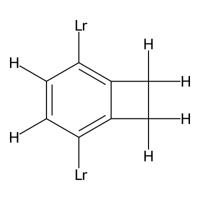

# Builder

Tools for generating and managing MOF building blocks (BBs).

## 1. make_bbs.py

Generate building block XYZ files from a single SELFIES string.

### Usage

```bash
# Single SELFIES string
python -m egmof.builder.make_bbs "[H][C][=C][Branch1][C][H][CH0][Branch1][C][Lr][=C][C][=Branch1][Branch1][=CH0][Ring1][Branch2][Lr][C][Branch1][C][H][Branch1][C][H][C][Ring1][Branch2][Branch1][C][H][H]" --engine xtb

# Specify output directory
python -m egmof.builder.make_bbs "[H][C][=C][Branch1][C][H][CH0][Branch1][C][Lr][=C][C][=Branch1][Branch1][=CH0][Ring1][Branch2][Lr][C][Branch1][C][H][Branch1][C][H][C][Ring1][Branch2][Branch1][C][H][H]" --run_dir /path/to/output --engine xtb
```

### Arguments

| Argument    | Description         | Default           |
| ----------- | ------------------- | ----------------- |
| `selfies`   | SELFIES string      | required          |
| `--run_dir` | Output directory    | `builder/new_bbs` |
| `--engine`  | Optimization engine | `xtb`             |

### Engine Options

- `xtb` — GFN-xTB tight optimization (recommended)
- `mmff` — MMFF94 force field (no external dependency)
- `uff` — UFF force field (no external dependency)

### Output Naming

- `[Lr] count = 2` → `Custom_E{n}.xyz` (Edge)
- `[Lr] count > 2` → `Custom_N{n}.xyz` (Node)

Counters auto-increment from existing files in `--run_dir`.

> **⚠️ Note:** SELFIES is not checked against existing databases (new_bbs or PORMAKE). Duplicate BBs may be generated without validation.

### xTB Auto-Install

If `xtb` engine is selected and the binary is not found, it will be auto-downloaded from GitHub.


## selfies2bb.py

Low-level SELFIES → XYZ conversion functions. Used by `make_bbs.py`.

### Functions

- `decode_selfies_to_xyz_opt()` — Main entry point
- `selfies_to_mol()` — SELFIES → RDKit molecule
- `run_xtb_tight()` — xTB geometry optimization
- `run_mmff94_opt()` — MMFF94 optimization
- `run_uff_opt()` — UFF optimization

### Usage

```python
from egmof.builder.make_bbs import make_bb
from egmof.builder import __builder_dir__

result = make_bb(
    "[H][C][=C][Branch1][C][H][CH0][Branch1][C][Lr][=C][C][=Branch1][Branch1][=CH0][Ring1][Branch2][Lr][C][Branch1][C][H][Branch1][C][H][C][Ring1][Branch2][Branch1][C][H][H]",
    run_dir= __builder_dir__   + "/examples/examples_bb/", #default
    #engine="xtb",
    #xtb_bin = "./xtb-dist/bin/" or /your/xtb/path/
   
)
print(result)  #True of False, path to output XYZ   
```
### Run

**Using Python (recommended):**
```python
from egmof.builder.make_bbs import make_bb
from egmof.builder import __builder_dir__

run_dir = __builder_dir__ + "/examples/examples_bb"
make_bb("[H][C][=C][Branch1][C][H][CH0][Branch1][C][Lr][=C][C][=Branch1][Branch1][=CH0][Ring1][Branch2][Lr][C][Branch1][C][H][Branch1][C][H][C][Ring1][Branch2][Branch1][C][H][H]", run_dir=run_dir)
```

**Using CLI:**
```bash
# Get builder directory first
BUILDER_DIR=$(python -c "from egmof.builder import __builder_dir__; print(__builder_dir__)")

# Then run
python -m egmof.builder.make_bbs "[H][C][=C][Branch1][C][H][CH0][Branch1][C][Lr][=C][C][=Branch1][Branch1][=CH0][Ring1][Branch2][Lr][C][Branch1][C][H][Branch1][C][H][C][Ring1][Branch2][Branch1][C][H][H]" --run_dir "$BUILDER_DIR/examples/examples_bb"
```

### Check the Results
```python
import os
from egmof.desc2mof.preprocessing import read_extended_xyz,  build_rdkit_mol
from egmof.builder import __builder_dir__
run_dir = os.path.join(__builder_dir__, "examples/examples_bb")
atoms, bonds = read_extended_xyz(f'{run_dir}/Custom_E1.xyz')
mol  = build_rdkit_mol (atoms, bonds)

```

### Generated MOF Building Blocks



### Batch Processing Multiple SELFIES

Process multiple SELFIES from a CSV file:

```python
import pandas as pd
from egmof.builder.make_bbs import make_bb
from egmof.builder import __builder_dir__

csv_path = __builder_dir__ + "/examples/SELFIES4CutomBB.csv"
run_dir = __builder_dir__ + "/new_bbs"

df = pd.read_csv(csv_path)
print(f"Loaded {len(df)} SELFIES from {csv_path}")

for idx, row in df.iterrows():
    selfies = row['SELFIES']
    name = row['Custom_Name']
    print(f"[{idx+1}/{len(df)}] Processing: {name}")
    success, result = make_bb(selfies, run_dir=run_dir, engine="xtb")
    if success:
        print(f"  -> {result}.xyz")
    else:
        print(f"  -> FAILED")

print("Done!")
```

Or run directly:

```bash
python -c "
import pandas as pd
from egmof.builder.make_bbs import make_bb
from egmof.builder import __builder_dir__

csv_path = __builder_dir__ + '/examples/SELFIES4CutomBB.csv'
run_dir = __builder_dir__ + '/new_bbs'

df = pd.read_csv(csv_path)
for idx, row in df.iterrows():
    selfies = row['SELFIES']
    name = row['Custom_Name']
    print(f'[{idx+1}/{len(df)}] {name}')
    success, result = make_bb(selfies, run_dir=run_dir, engine='xtb')
    print(f'  -> {\"OK\" if success else \"FAIL\"}')"


```

## 2. build_MOFs.py

Generate full MOF structures (CIF files) from topology + building block names.

### Generate Multiple MOFs from List

Read MOF names from `generated_cif_list.txt` and generate CIF files:

```python
import os
from egmof.builder.build_MOFs import name_to_mof
from egmof.builder import __builder_dir__

# Paths
mof_list_path = __builder_dir__ + "/examples/generated_cif_list.txt"
cif_output_dir = __builder_dir__ + "/examples/cifs"
os.makedirs(cif_output_dir, exist_ok=True)

# Read MOF name list
with open(mof_list_path, "r") as f:
    mof_names = [line.strip() for line in f if line.strip()]

print(f"Found {len(mof_names)} MOFs to generate")

# Generate each MOF
for mof_name in mof_names:
    print(f"Generating: {mof_name}")
    try:
        mof = name_to_mof(mof_name)
        if mof is not None:
            # Save as CIF
            cif_path = os.path.join(cif_output_dir, f"{mof_name}.cif")
            mof.write_cif(cif_path)
            print(f"  -> Saved: {cif_path}")
        else:
            print(f"  -> Failed to generate MOF")
    except Exception as e:
        print(f"  -> Error: {e}")

print("Done!")
```

### Example MOF Names

```
msw+N179+E138         # topology + node + edge (from PORMAKE)
srs+N298+E0           # edge E0 = simple link
rac+N492+E11
zfz+N254+E84
unj+N371+E217
sol+N343+E73
ecf+N331+Custom_E30   # uses custom edge (Custom_E30)
tsx+N595+Custom_N18+E19  # uses custom node + edge
```

### Single MOF Generation

```python
from egmof.builder.build_Mofs import name_to_mof

# Generate MOF with custom building blocks
mof = name_to_mof("pcu+Custom_N1+Custom_E1")

if mof:
    mof.write_cif("my_mof.cif")
```

### Custom BB Directory

If your custom building blocks are in a different location:

```python
mof = name_to_mof(
    "pcu+Custom_N1+E1",
    new_bb_dir="/path/to/your/bbs"
)
```

### Using CLI (build_MOFs.py)

Run from command line:

```bash
# Default: use generated_cif_list.txt, save to examples/cifs/
python -m egmof.builder.build_MOFs

# Specify custom candidate file
python -m egmof.builder.build_MOFs /path/to/mof_list.txt

# Specify output directory
python -m egmof.builder.build_MOFs -s /output/dir

# Set cell length cutoff (only save MOFs with max_cell < cutoff)
python -m egmof.builder.build_MOFs -co 60.0

# Full example
python -m egmof.builder.build_MOFs -s ./cifs -co 50.0
```

### Arguments

| Argument | Short | Default | Description |
|----------|-------|---------|-------------|
| `--candidates` | `-c` | `examples/generated_cif_list.txt` | MOF name list file |
| `--save-dir` | `-s` | `examples/cifs/` | Output directory |
| `--cutoff` | `-co` | `1e9` | Max cell length (default saves all) |
| `--bb-dir` | `-b` | PORMAKE default | Custom BB directory |
| `--topo-dir` | `-t` | PORMAKE default | Custom topology directory |

```